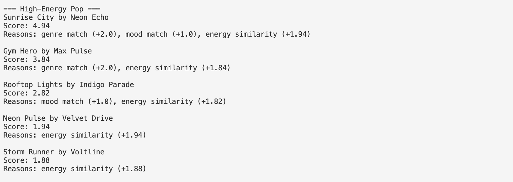
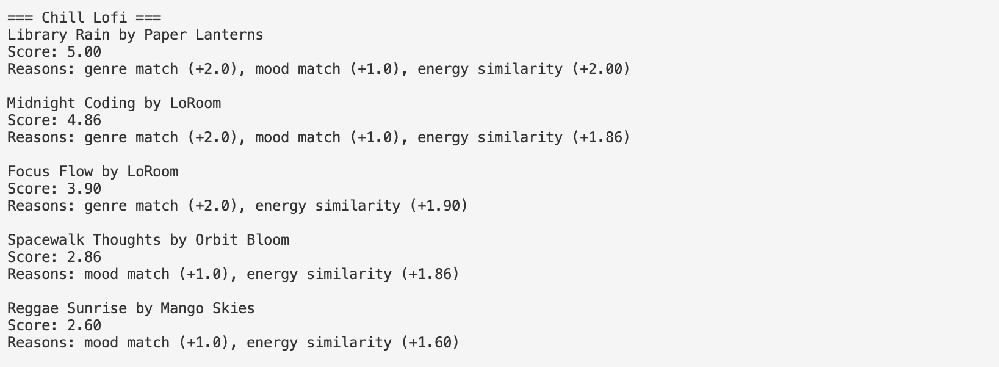
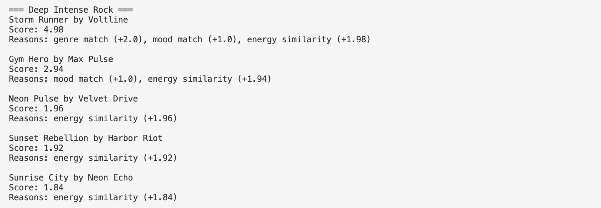
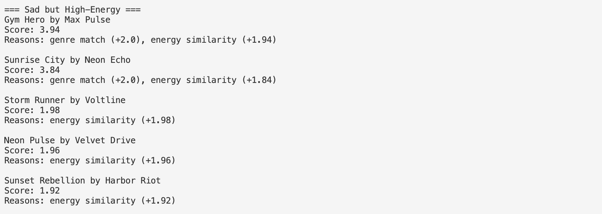

# 🎵 Music Recommender Simulation

## Project Summary

In this project you will build and explain a small music recommender system.

Your goal is to:

- Represent songs and a user "taste profile" as data
- Design a scoring rule that turns that data into recommendations
- Evaluate what your system gets right and wrong
- Reflect on how this mirrors real world AI recommenders

Replace this paragraph with your own summary of what your version does.

Real-world music recommendation systems use large amounts of user behavior data, such as listening history, likes, skips, and playlists, along with information about the songs themselves. Platforms like Spotify and YouTube use both collaborative filtering and content-based filtering to predict what users may enjoy next.

In this project, I am building a simplified content-based recommender. My system focuses on matching songs to a user's preferred genre, mood, and energy level. It also considers other attributes like valence and tempo to better capture the overall vibe of a song. Each song receives a score based on how closely its attributes match the user's taste profile. After scoring every song in the dataset, the system ranks them and recommends the songs with the highest scores.

Song Features
- genre
- mood
- energy
- tempo_bpm
- valence
- danceability
- acousticness

UserProfile Features
- favorite_genre
- favorite_mood
- target_energy
- likes_acoustic

## How The System Works

Explain your design in plain language.

Some prompts to answer:

- What features does each `Song` use in your system
  - For example: genre, mood, energy, tempo
- What information does your `UserProfile` store
- How does your `Recommender` compute a score for each song
- How do you choose which songs to recommend

You can include a simple diagram or bullet list if helpful.

The recommender evaluates every song in the dataset and assigns a score based on how well the song matches the user’s preferences.

1. Look at each song in `songs.csv`.
2. Start the song’s score at 0.
3. Add points if the song’s genre matches the user’s favorite genre.
4. Add points if the song’s mood matches the user’s favorite mood.
5. Add points when the song’s energy is close to the user’s target energy.
6. Add points when the song’s valence is close to the user’s target valence.
7. Add a bonus if the song’s acousticness matches whether the user prefers acoustic music.
8. After scoring all songs, rank them from highest to lowest score.
9. Return the top recommended songs.

- +2 points if the song genre matches the user's favorite genre
- +1 point if the song mood matches the user's favorite mood
- Up to +2 points depending on how close the song's energy is to the user's target energy

After calculating the score for each song, the recommender ranks all songs from highest to lowest score and returns the top recommendations.

This system may over-prioritize genre, which means it could miss songs from other genres that still match the user's mood or energy. Because the dataset is small, the recommendations may also be limited and not reflect the full diversity of music that a user might enjoy.

## CLI Output Example

Below is an example of the recommender running in the terminal.


## Evaluation Screenshots

### High-Energy Pop


### Chill Lofi


### Deep Intense Rock


### Sad but High-Energy



## Getting Started

### Setup

1. Create a virtual environment (optional but recommended):

   ```bash
   python -m venv .venv
   source .venv/bin/activate      # Mac or Linux
   .venv\Scripts\activate         # Windows

2. Install dependencies

```bash
pip install -r requirements.txt
```

3. Run the app:

```bash
python -m src.main
```

### Running Tests

Run the starter tests with:

```bash
pytest
```

You can add more tests in `tests/test_recommender.py`.

---

## Experiments You Tried

Use this section to document the experiments you ran. For example:

- What happened when you changed the weight on genre from 2.0 to 0.5
- What happened when you added tempo or valence to the score
- How did your system behave for different types of users

---

## Limitations and Risks

Summarize some limitations of your recommender.

Examples:

- It only works on a tiny catalog
- It does not understand lyrics or language
- It might over favor one genre or mood

You will go deeper on this in your model card.

---

## Reflection

Read and complete `model_card.md`:

[**Model Card**](model_card.md)

Write 1 to 2 paragraphs here about what you learned:

- about how recommenders turn data into predictions
- about where bias or unfairness could show up in systems like this


---

## 7. `model_card_template.md`

Combines reflection and model card framing from the Module 3 guidance. :contentReference[oaicite:2]{index=2}  

```markdown
# 🎧 Model Card - Music Recommender Simulation

## 1. Model Name

Give your recommender a name, for example:

> VibeFinder 1.0

---

## 2. Intended Use

- What is this system trying to do
- Who is it for

Example:

> This model suggests 3 to 5 songs from a small catalog based on a user's preferred genre, mood, and energy level. It is for classroom exploration only, not for real users.

This recommender system suggests songs based on a user's music preferences. It generates recommendations by comparing a user’s favorite genre, mood, and energy level with the attributes of songs in the dataset.

The model assumes that users have clear preferences for genre, mood, and energy. It uses these preferences to rank songs that are most similar to what the user wants.

This project is designed for classroom exploration to demonstrate how a basic recommendation system works. It is not intended for real-world music recommendation services.

## 3. How It Works (Short Explanation)

Describe your scoring logic in plain language.

- What features of each song does it consider
- What information about the user does it use
- How does it turn those into a number

Try to avoid code in this section, treat it like an explanation to a non programmer.

The recommender assigns a score to each song based on how well it matches the user’s preferences.

The model looks at three main features of each song: genre, mood, and energy. The user also provides their preferred genre, preferred mood, and a target energy level.

If a song matches the user’s favorite genre, it receives two points. If the mood matches, it receives one point. The system also compares the song’s energy level to the user’s target energy and gives additional points based on how similar they are.

All songs are scored using these rules and then sorted from highest score to lowest score. The top five songs are returned as the recommendations.

## 4. Data

Describe your dataset.

- How many songs are in `data/songs.csv`
- Did you add or remove any songs
- What kinds of genres or moods are represented
- Whose taste does this data mostly reflect

The dataset used in this project contains 18 songs stored in a CSV file. Each song includes features such as title, artist, genre, mood, energy, tempo, valence, danceability, and acousticness.

The dataset includes a variety of genres and moods, such as pop, rock, and lofi, along with moods like chill, happy, and intense.

However, the dataset is very small and does not represent the full range of musical tastes. Some genres and moods are underrepresented, which limits the variety of recommendations the system can generate.

## 5. Strengths

Where does your recommender work well

You can think about:
- Situations where the top results "felt right"
- Particular user profiles it served well
- Simplicity or transparency benefits

The system works well for user profiles that closely match songs in the dataset. For example, the Chill Lofi profile produced very accurate results because the dataset included several songs with similar genre, mood, and energy levels.

The scoring system also successfully captures patterns between user preferences and song attributes. Songs that match both genre and mood tend to appear near the top of the recommendation list.

In several cases, the recommendations matched my intuition about what songs should appear for certain profiles.

## 6. Limitations and Bias

Where does your recommender struggle

Some prompts:
- Does it ignore some genres or moods
- Does it treat all users as if they have the same taste shape
- Is it biased toward high energy or one genre by default
- How could this be unfair if used in a real product

One limitation I found is that the scoring system can become heavily dominated by energy if that feature is given too much weight. During my experiment, songs with similar energy levels ranked highly even when they did not match the user’s preferred genre or mood. This can create a filter bubble where energetic songs keep appearing for many different profiles. Another limitation is that the dataset is small, so the same songs can show up repeatedly across multiple recommendation lists.


## 7. Evaluation

How did you check your system

Examples:
- You tried multiple user profiles and wrote down whether the results matched your expectations
- You compared your simulation to what a real app like Spotify or YouTube tends to recommend
- You wrote tests for your scoring logic

You do not need a numeric metric, but if you used one, explain what it measures.

I tested the recommender with four profiles: High-Energy Pop, Chill Lofi, Deep Intense Rock, and Sad but High-Energy. Before the experiment, the system balanced genre, mood, and energy in a way that made the results feel more targeted to each profile. The Chill Lofi profile produced the most accurate results because the top songs matched the intended genre, mood, and energy level very closely. The Deep Intense Rock and Sad but High-Energy profiles showed that when the dataset has fewer exact matches, the system starts relying more on energy similarity.

For my experiment, I reduced the genre match weight from +2 to +1 and increased the energy similarity weight from a maximum of +2 to a maximum of +4. After this change, the recommendations became more driven by energy than by genre. Songs like Gym Hero, Storm Runner, Neon Pulse, and Sunrise City appeared more often across different profiles because their energy levels were very close to the target values. This made the recommendations more varied in one sense, but it also made different profiles feel less distinct from each other.

## 8. Future Work

If you had more time, how would you improve this recommender

Examples:

- Add support for multiple users and "group vibe" recommendations
- Balance diversity of songs instead of always picking the closest match
- Use more features, like tempo ranges or lyric themes


If I continued improving this model, I would first expand the dataset to include more songs and genres. This would make the recommendations more diverse and realistic.

I would also include additional song features, such as valence and danceability, in the scoring system so the recommendations could capture more aspects of musical taste.

Another improvement would be allowing users to give feedback on recommendations so the system could learn and adjust its scoring over time.

## 9. Personal Reflection

A few sentences about what you learned:

- What surprised you about how your system behaved
- How did building this change how you think about real music recommenders
- Where do you think human judgment still matters, even if the model seems "smart"

Building this project helped me understand how recommendation systems turn user preferences into scores that rank content. Even though the algorithm is simple, small changes in scoring weights had a noticeable impact on the recommendations. For example, when I increased the importance of energy during my experiment, many of the same high-energy songs appeared across different user profiles. This showed me how sensitive recommendation systems can be to design choices and how bias can appear even in simple models.